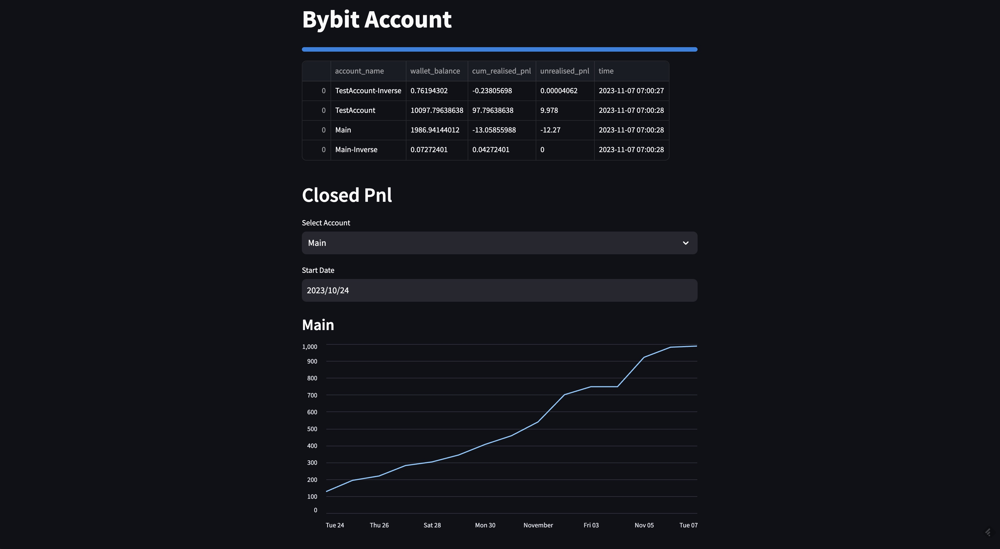

# Bybit-Monitor


## How to setup

### for docker
```
docker-compose build
docker-compose up
```
### config

Create some configuration. Each config file has `.example` file.

- create `.env` 
- create `config.json` or `config.test.json` for DEBUG=True
- create `.streamlit/secrets.toml`

Access to https://localhost:8080

## How to deploy for GCP

Use Cloud Build and set substitutions in GCP console.

```
_REGION: asia-southeast1
_SERVICE_NAME: bybit-monitor
_CONFIG_JSON_BASE64: ewogICAgImJ5Yml0Ijp7CiAgICAgICAgCiAgICB9Cn0=
_STREAMLIT_SECRETS_BASE64: cGFzc3dvcmQgPSAic3RyZWFtbGl0MTIzIg==
```